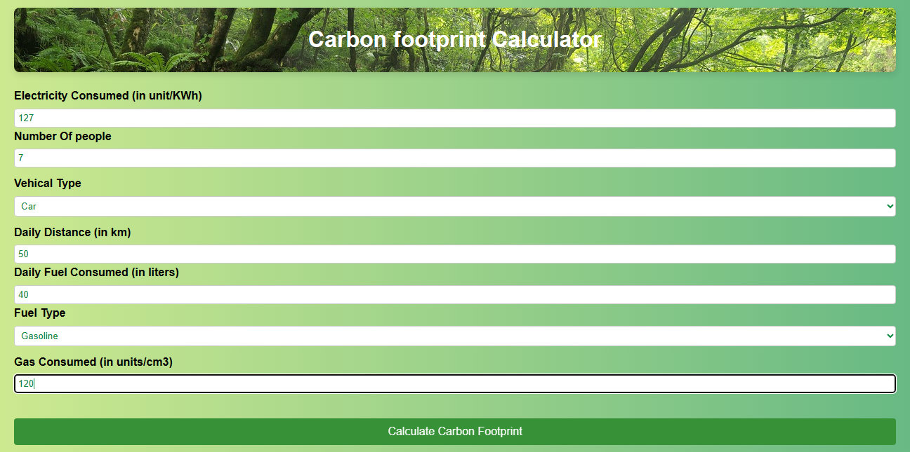

# Carbon Footprint Calculator

The **Carbon Footprint Calculator** is a web-based tool designed to help individuals and organizations assess their carbon emissions and make informed decisions to reduce their environmental impact. By inputting various factors and activities, users can estimate their carbon footprint and receive recommendations on how to lower it.

## Table of Contents

- [Introduction](#introduction)
- [Features](#features)
  - [Electricity Consumption](#electricity-consumption)
  - [Transportation Emissions](#transportation-emissions)
  - [Natural Gas Consumption](#natural-gas-consumption)
- [Getting Started](#getting-started)
- [Usage](#usage)

## Introduction

As concerns about climate change and environmental sustainability grow, understanding and mitigating our carbon footprint has become essential. The Carbon Footprint Calculator aims to simplify this process by providing an intuitive interface to calculate and manage individual or organizational carbon emissions.

## Features

### Electricity Consumption

- Users can input their monthly electricity consumption in kilowatt-hours (KWh).
- The calculator estimates the carbon emissions based on a predefined energy emission factor.

### Transportation Emissions

- Users can select their mode of transportation, including options like bike, car, public transport, or by foot.
- For vehicles, users can provide daily distance covered and fuel consumption (if applicable).
- The calculator utilizes emission factors specific to each transportation mode and fuel type to estimate emissions.

### Natural Gas Consumption

- Users can input their monthly natural gas consumption in cubic centimeters (cm³).
- The calculator estimates carbon emissions associated with natural gas usage.

### Personalized Recommendations

- After calculating the carbon footprint, users receive recommendations to reduce their emissions.
- Tips include adopting energy-efficient habits, sustainable transportation options and eco-friendly dietary choices.

### Easy-to-Use Interface

- The calculator provides a user-friendly interface with clear labels and placeholders for data input.
- Dynamic interactions guide users based on their vehicle and fuel type selections.

### Educative Information

- The calculator offers a section explaining the limitations and variables affecting the calculations.
- Users are informed about the average emission factors and assumptions used in transportation calculations.

  **Note:** Keep in mind that it's just a rough estimation. The carbon footprint calculations provided for different modes of transportation, such as bikes, cars, and public transport, are based on average emission factors and assumptions. The actual carbon emissions may vary based on various factors, including the specific make and model of the vehicle, driving conditions, individual driving habits, and maintenance practices.

## Getting Started

To run the Carbon Footprint Calculator locally, follow these steps:

1. Clone this repository: `git clone https://github.com/your-username/carbon-footprint-calculator.git`
2. Navigate to the project directory: `cd carbon-footprint-calculator`
3. Open the `index.html` file in a web browser.

## Usage

1. Open the Carbon Footprint Calculator in your web browser.
2. Input your monthly electricity consumption, number of people, and transportation details.
3. Select your vehicle type and provide relevant data (daily distance, fuel consumption).
4. Input your monthly natural gas consumption if applicable.
5. Click the "Calculate Carbon Footprint" button to estimate your total carbon footprint.
6. View the calculated carbon footprint and read the personalized recommendations for reducing emissions.
